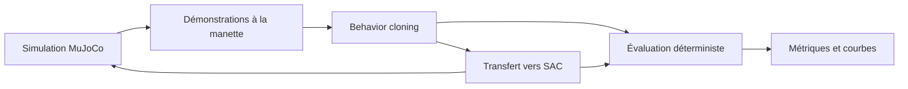

# Adaptive Manipulation Lab

**Apprentissage de la manipulation robotique par démonstrations humaines et renforcement, dans MuJoCo.**

Adaptive Manipulation Lab explore la construction d'une politique capable de contrôler un bras robotique pour interagir avec des objets. L'objectif à terme est d'enchaîner l'approche, la saisie et le déplacement d'un objet, avec une évaluation reproductible sur différents placements initiaux.

Le projet progresse par tâches successives. La première consiste à **atteindre un cube avec la pince**. Elle fournit le socle de simulation, de collecte de données, d'apprentissage et d'évaluation pour les étapes de manipulation suivantes.

## État du projet

La tâche actuelle, `reach`, utilise un bras à trois articulations et une pince symétrique. Une réussite correspond à un contact actif du cube avec un doigt ou le support de la pince. Le contact termine l'épisode ; la saisie et le transport de l'objet restent des objectifs de développement.

| Composant | Fonctionnalités disponibles |
|---|---|
| Simulation | Scène MuJoCo, placements reproductibles par seed, interface Gymnasium |
| Commande humaine | Pilotage avec curseurs et manette DualSense |
| Démonstrations | Enregistrement des transitions, signatures de compatibilité, reprise de collecte |
| Behavior cloning (BC) | Apprentissage supervisé de l'Actor sur les actions humaines |
| Soft Actor-Critic (SAC) | Double Critic, replay, exploration gaussienne, réglage automatique de l'entropie |
| Transfert BC → SAC | Initialisation de l'Actor, import des démonstrations d'apprentissage, préparation des Critics |
| Évaluation | Rollouts déterministes, séparation des seeds, visualisation et export CSV |
| Suivi des expériences | Checkpoints, reprise SAC, diagnostics des réseaux et des actions, courbes BC/SAC |

La première étape dispose de politiques capables d'atteindre le cube dans les scénarios évalués. Le dataset de référence contient **30 démonstrations réussies et 9 067 transitions**. Le modèle BC atteint **6 réussites sur 6 scénarios de validation** ; le run SAC issu du BC enregistre également un taux de réussite de 100 % à sa dernière validation consignée, sur ces mêmes six seeds. Ces mesures portent sur la tâche de contact et sur un petit ensemble de sélection du modèle.

Les protocoles, résultats et limites sont détaillés dans [Expériences et résultats](docs/experiments.md).

## Approche

Les démonstrations humaines fournissent des trajectoires proches de l'objet et des exemples de réussite. Le behavior cloning apprend une politique initiale à partir de ces actions. SAC poursuit l'apprentissage par interaction avec la simulation et optimisation de la reward.



La politique reçoit 38 valeurs décrivant l'état physique, les consignes de commande et le budget d'épisode restant. Elle produit quatre actions normalisées : trois incréments articulaires et un incrément d'ouverture de pince. Le même contrat d'observation et d'action est utilisé pour la collecte, le BC et SAC.

## Installation

Prérequis : **Python 3.11 ou plus**. Les commandes suivantes utilisent PowerShell depuis la racine du dépôt.

```powershell
python -m venv .venv
.\.venv\Scripts\python.exe -m pip install --upgrade pip
.\.venv\Scripts\python.exe -m pip install -e ".[interactive,analysis]"
```

Les dépendances centrales sont NumPy, MuJoCo, Gymnasium et PyTorch. L'option `interactive` ajoute pygame pour la manette ; `analysis` ajoute pandas et matplotlib pour les courbes. Les dépendances sont définies dans [pyproject.toml](pyproject.toml).

Le fichier `requirements-cuda.txt` permet une installation avec le dépôt de roues PyTorch CUDA 12.6 :

```powershell
.\.venv\Scripts\python.exe -m pip install -r requirements-cuda.txt
```

BC accepte `--device auto`, `cpu` ou `cuda`. SAC utilise le device de sa configuration, modifiable avec `--device`. L'évaluation utilise CPU par défaut. La configuration `configs/training.json` choisit CUDA ; `configs/smoke.json` utilise CPU.

## Démarrage rapide

L'interface commune est `python -m adaptive_manipulation`. L'installation fournit également la commande `aml` dans l'environnement virtuel.

```powershell
# Liste des commandes.
.\.venv\Scripts\python.exe -m adaptive_manipulation --help

# Exploration manuelle de la scène.
.\.venv\Scripts\python.exe -m adaptive_manipulation manual --episodes 5 --seed 42

# Vérification du dataset de référence.
.\.venv\Scripts\python.exe -m adaptive_manipulation inspect-demos demonstrations/gamepad_30

# Évaluation visuelle du checkpoint BC sur son split de validation.
.\.venv\Scripts\python.exe -m adaptive_manipulation evaluate runs/bc_gamepad/best.pt --split validation --render
```

La commande d'évaluation suppose que le checkpoint indiqué est présent dans le checkout. Les expériences et leurs fichiers binaires sont des artefacts locaux ; l'installation du package ne les télécharge pas.

| Commande | Fonction |
|---|---|
| `manual` | Pilotage avec manette et curseurs |
| `record` | Collecte de démonstrations |
| `inspect-demos` | Validation d'un dataset |
| `train-bc` | Entraînement par imitation |
| `train-sac` | Entraînement SAC, transfert BC ou reprise |
| `evaluate` | Évaluation d'un checkpoint BC ou SAC |
| `plot` | Visualisation des CSV d'une expérience |

Chaque commande expose ses options avec `--help`. Les procédures complètes d'enregistrement, d'entraînement, de reprise et d'évaluation figurent dans le [guide de la pipeline](docs/pipeline.md).

## Organisation du dépôt

```text
adaptive_manipulation/   Package Python : simulation, tâches, données et apprentissage
configs/                Configurations d'expériences
models/                 Scène MuJoCo du robot
tests/                  Tests automatisés
demonstrations/         Sessions de démonstrations humaines
runs/                   Checkpoints, configurations et métriques d'entraînement
docs/                   Documentation d'utilisation, architecture et expériences
reports/                Mesures d'audit, figures et traces de vérification
data_doc/               Médias de documentation
```

Les tâches définissent les critères de réussite et la reward. La simulation porte le contrat physique. Les workflows assemblent les composants pour la collecte, l'entraînement et l'évaluation. Les réseaux et le replay sont séparés des interfaces graphiques. Cette organisation permet de faire évoluer la tâche tout en réutilisant les composants d'apprentissage.

## Étapes de développement

| Étape | Objectif | État |
|---|---|---|
| Approche | Atteindre le cube avec la pince | Implémentée, évaluée sur les scénarios de référence |
| Saisie | Fermer la pince autour du cube et maintenir une prise stable | À développer |
| Manipulation | Soulever puis déplacer l'objet vers une cible | À développer |
| Généralisation | Étendre l'évaluation à davantage de placements et de conditions | À approfondir pour chaque tâche |

Les étapes de saisie et de manipulation nécessitent de nouveaux critères de réussite, des observations adaptées et des données correspondant à ces objectifs. Le [guide d'architecture](docs/architecture.md) décrit les points d'extension et le versionnement des contrats.

## Développement et tests

```powershell
.\.venv\Scripts\python.exe -m unittest discover -s tests -v
```

Les tests couvrent la simulation, les fins d'épisode, les commandes, le replay, SAC, les démonstrations, le BC, le transfert et la reprise. Les artefacts des tests sont créés dans des dossiers temporaires.

## Documentation

- [Pipeline : collecte, BC, SAC et évaluation](docs/pipeline.md)
- [Architecture : composants, contrats et extensions](docs/architecture.md)
- [Expériences : protocoles, résultats et limites](docs/experiments.md)

Les CSV, sessions, checkpoints et configurations d'expérience constituent les sources des résultats. Les fichiers de `docs/archive/` documentent les versions historiques des commandes et de l'audit SAC.
