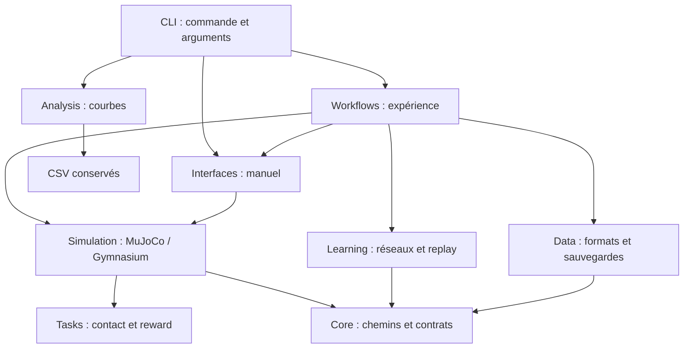

# Architecture et évolution du projet

[Présentation du projet](../README.md) · [Pipeline](pipeline.md) · [Expériences](experiments.md)

Le package `adaptive_manipulation` rassemble le code exécutable. Le découpage suit les responsabilités de la pipeline, avec une tâche actuelle explicite : atteindre le cube par contact avec la pince. Les données d'expérience restent extérieures au package.

## Responsabilités et dépendances

| Dossier | Responsabilité | Points d'entrée utiles |
|---|---|---|
| `core` | Paramètres sérialisables, ressources, versions | `TrainingConfig`, `SACConfig`, `BCConfig`, `paths.py`, `contracts.py` |
| `tasks` | Critère de réussite et calcul de reward | `reach.RewardCalculator`, `reach.has_gripper_contact` |
| `simulation` | Charger MuJoCo, scénarios, contrôle et observations | `Environment`, `ManipulationEnv` |
| `interfaces` | Interaction humaine | `run_manual`, `PS5Controller`, `normalized_gamepad_action` |
| `data` | Formats, validation, sauvegardes, métriques | `DemoRecorder`, `load_demonstrations`, `split_episodes`, `load_checkpoint`, `CSVLog` |
| `learning` | Réseaux et opérations d'apprentissage | `Actor`, `SACAgent`, `ReplayBuffer`, `BCPolicy`, `evaluate_policy` |
| `workflows` | Assemblage d'une expérience et gestion de son cycle de vie | `train_bc`, `train`, `bc_transfer`, `record`, `evaluate` |
| `analysis` | Lecture et visualisation des CSV | `plot_runs` |



`learning/evaluation.py` manipule une politique et un environnement par leur interface ; il ne crée ni scène ni viewer. La CLI importe uniquement la commande sélectionnée. Son aide générale n'importe pas PyTorch, pygame ou MuJoCo et n'ouvre aucune fenêtre.

Le workflow `workflows/bc_transfer.py` orchestre le transfert entre dataset, checkpoint, replay, agent et environnement. Le stockage des checkpoints BC et SAC se trouve dans `data/checkpoints.py`, et le split des données dans `data/demonstrations.py`.

## Contrat de la simulation

`simulation/environment.py` gère les placements, contacts, rewards et résultats de scénarios. Il reçoit des consignes physiques absolues et peut passer automatiquement au scénario suivant dans une session manuelle. Le mode manuel utilise une horloge réelle ; les entraînements, évaluations et enregistrements utilisent le temps physique MuJoCo.

`simulation/gym_env.py` fournit une interface de décision incrémentale :

```python
from adaptive_manipulation.simulation.gym_env import ManipulationEnv

env = ManipulationEnv(render_mode="machine")
try:
    observation, info = env.reset(seed=42)
    action = env.action_space.sample()
    next_observation, reward, terminated, truncated, info = env.step(action)
finally:
    env.close()
```

L'adaptateur ne remet pas silencieusement l'épisode à zéro : appeler `reset()` après une fin. Le dernier `next_observation` appartient à l'épisode terminé, ce qui est essentiel pour le replay. Les consignes sont incluses dans l'observation car l'action suivante est un incrément de ces consignes.

Pour le XML actuel, l'ordre de l'observation est :

| Indices | Contenu |
|---|---|
| `0:12` | `qpos` : positions articulaires, doigts, position et quaternion du cube |
| `12:23` | `qvel` : vitesses généralisées |
| `23:26` | Centre de la pince |
| `26:29` | Centre du cube |
| `29:32` | Vecteur cube moins pince |
| `32:36` | Consignes J1/J2/J3 et ouverture des doigts |
| `36:38` | Fractions de temps et de décisions restantes |

L'action contient trois incréments articulaires normalisés et un incrément commun d'ouverture. L'adaptateur multiplie par vitesse × durée de décision, borne les consignes et envoie les positions cibles aux actionneurs MuJoCo. La pince symétrique conserve deux actionneurs physiques pour un seul canal de politique.

Le contact actif avec les doigts **ou le support de pince** compte actuellement comme réussite. Le timeout et la limite de décisions sont des échecs terminaux, pas une interruption extérieure. Le replay conserve séparément `terminated` et `truncated` ; SAC masque le bootstrap avec `terminated`. Une interruption extérieure devrait utiliser `truncated` et conserver une observation de continuation valide.

## Sauvegardes et reproductibilité

- `core/contracts.py` centralise les versions du sens des observations et de la tâche : `observation_version=2` et `task_version=2`.
- Les démonstrations et checkpoints BC stockent une signature incluant XML, dimensions et paramètres de contrôle. Le transfert compare ces signatures et vérifie les empreintes des épisodes importés.
- Un checkpoint BC contient l'Actor et le split. Un snapshot SAC contient aussi Critics, réseaux cibles, alpha, optimiseurs, replay, RNG, état physique et compteurs d'entraînement.
- `_LegacyUnpickler` traduit uniquement l'ancien nom `environment.ScenarioResult`. Les tenseurs et les données ne sont pas convertis. Les modèles du contrat 1 restent incompatibles avec la tâche actuelle malgré leur lecture possible.
- Les datasets originaux et les runs constituent la provenance scientifique : créer de nouvelles sessions et nouveaux dossiers pour les expériences suivantes.

Les chemins par défaut de `core/paths.py` pointent vers le dépôt contenant le package. Le projet s'installe en mode éditable ; les fichiers XML et JSON restent des ressources de ce dépôt. Pour distribuer ultérieurement une roue autonome, il faudra décider explicitement quels modèles/configurations embarquer et adapter leur résolution.

## Extension de la tâche : saisie du cube

1. Définir les critères mesurables : contact de deux doigts, stabilité, élévation, maintien et durée. Ajouter une tâche dans `tasks/`, avec des tests du succès, des échecs et de la reward.
2. Adapter le moteur de scénario et l'adaptateur Gymnasium pour sélectionner cette tâche. Si plusieurs tâches coexistent, ajouter une sélection explicite dans la configuration et une construction d'environnement partagée par les workflows. La version actuelle utilise directement la tâche `reach` ; aucun registre de tâches n'est nécessaire avant cette évolution.
3. Ajouter les observations utiles à la nouvelle décision : contacts, pose relative, vitesse, état de la prise. Modifier `observation_version` si leur ordre ou signification change, et `task_version` si la reward, la réussite ou l'horizon changent. Si des contrats différents doivent coexister, porter ces versions par tâche plutôt qu'augmenter globalement une constante.
4. Vérifier que les quatre actions suffisent. Si la commande change, mettre à jour l'adaptateur, l'interface de collecte, les signatures et le dimensionnement des politiques. Les réseaux SAC acceptent des dimensions d'entrée/sortie ; les interfaces et plusieurs diagnostics supposent actuellement quatre canaux et devront être adaptés ensemble.
5. Créer une nouvelle configuration, une nouvelle session de démonstrations et un nouveau run. Des poids BC de reach peuvent servir de départ uniquement si le contrat réseau et physique permet un transfert explicite ; les anciennes transitions ne représentent pas automatiquement la reward ou la réussite de la nouvelle tâche.
6. Réserver les seeds d'évaluation, entraîner puis mesurer la nouvelle réussite en rollout. Ne pas utiliser le simple contact comme indicateur de saisie réussie.

Pour un autre robot ou XML, auditer les noms d'articulations/actionneurs, les géométries de contact, les sites, le placement du cube et les plages de contrôle. Séparer ces éléments dans une description du robot quand un second robot existe. Le découpage actuel facilite cette extraction sans prétendre rendre tous les XML interchangeables.

## Organisation des ressources

Le package contient le code exécutable. La CLI expose les opérations manuelles, la collecte, les entraînements et l'analyse. La politique BC appartient à `learning/`, ses paramètres à `core/`, son split et ses sauvegardes à `data/`, et son entraînement à `workflows/`. Les rollouts communs sont définis dans `learning/evaluation.py` et les journaux CSV dans `data/logging.py`.

`tests/` contient les tests et `configs/` les configurations d'expériences. `runs/` regroupe les artefacts d'entraînement ; `demonstrations/` contient les sessions originales. `models/` porte la scène physique et `data_doc/` les médias. Les versions historiques des commandes et de l'audit SAC sont référencées dans `docs/archive/`.

## Vérifier une modification

```powershell
.\.venv\Scripts\python.exe -m unittest discover -s tests -v
.\.venv\Scripts\python.exe -m adaptive_manipulation --help
.\.venv\Scripts\python.exe -m adaptive_manipulation inspect-demos demonstrations/gamepad_30
```

Lors d'un changement de simulation, vérifier les observations, l'action exécutée, la fin d'épisode et les signatures. Pour l'apprentissage, vérifier une mise à jour et la reprise depuis snapshot. Les tests créent leurs artefacts dans des répertoires temporaires ; ils ne réécrivent pas les runs conservés.
